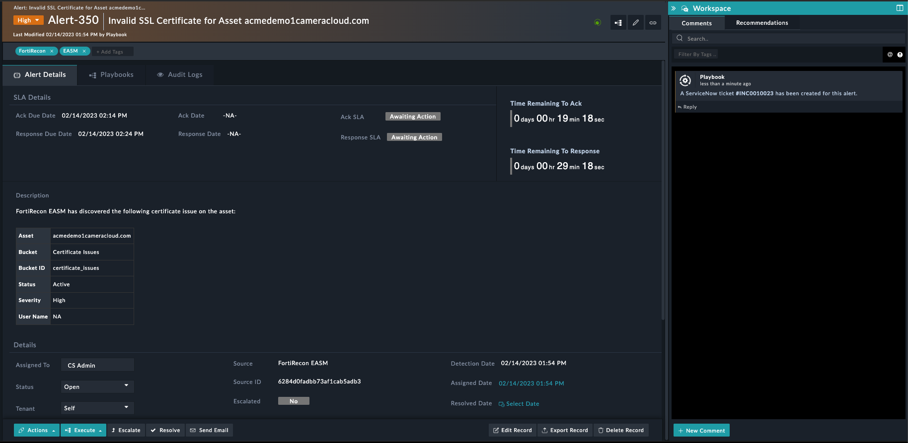

| [Home](../README.md) |
|----------------------|
# Usage

Refer to [Simulate Scenario documentation](https://github.com/fortinet-fortisoar/solution-pack-soc-simulator/blob/develop/docs/usage.md) to understand how to simulate and reset scenarios.

To understand the process FortiSOAR follows to respond to alerts related to certificate issues for assets discovered by FortiRecon EASM, we have included a scenario &mdash; **Certificate Issue Discovered** with this solution pack.

## Certificate Issue Discovered

This scenario generates an example alert of Type *Certificate Monitoring* in FortiSOAR's **Alerts** module.

Navigate to demo alert and note the following:

- The demo alert created is an example of a FortiRecon EASM scan detecting a certificate issue on the asset
- The alert is of type *Certificate Monitoring*
- The reported alert contains the following information:
    - Certificate Issue Details:
        - Asset Name
        - Bucket
        - Bucket ID
        - Severity 
        - Status
        - User Name
    - Source
    - Source ID
    - Type

- The response playbook `Certificate Issue Response` runs automatically when all the indicators are extracted and enriched
    - This playbook creates a ServiceNow ticket to fix the certificate issue discovered on the asset

    

